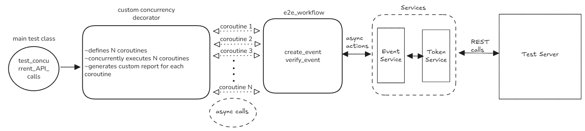

# Cloud Integration Test Framework

Concurrent test framework for cloud event processing with async timing handling.

## Setup

1. Clone the repository locally
2. Install dependencies
```bash
pip install pytest pytest-asyncio httpx pydantic tabulate
```
2. Run the test server

## Running Tests

Execute 100 concurrent tests:
```bash
pytest tests/test_api_concurrent_requests.py -v
pytest tests/test_api_concurrent_requests.py -v -s #for more debug logs
```
* HTML results are stored in ```results/``` folder
* Console results are printed in terminal

## Design



**Architecture:**
- `TokenService`: Thread-safe singleton managing shared authentication tokens
- `EventService`: Handles event creation and status polling  
- `@concurrent_tests(100)`: Decorator executing 100 tests simultaneously via `asyncio.gather()`

#### Note: #### 
This is not calling ```/event``` in loop, since the loop is only used to define the coroutines and the asyncio.gather() triggers the coroutines asynchronously.

**Concurrency Safety:**
- `asyncio.Lock()` prevents token refresh race conditions
- Double-checked locking pattern for token validation
- Each test runs independently with shared token management

**Timing Strategy:**
- Exponential backoff: 25s → 37.5s → 56.25s → 60s (capped)
- 190s maximum timeout per test
- Non-blocking polling allows concurrent execution

## Reports

- Console output with test summary
- HTML reports saved to `./reports/` with timestamps

## Assumptions

- Test server runs on `localhost:8000`
- Single user (test) for the entire tests
- Events have a random uniform delay of 20-180s
- Using asyncio since it is better suited for I/O operations compared to resource heavy threading/ multi-processing
-  Coroutines simulate individual test cases within a single pytest test, 
  since pytest doesn't support concurrent execution of separate test 
  functions without multiprocessing (pytest-xdist)
